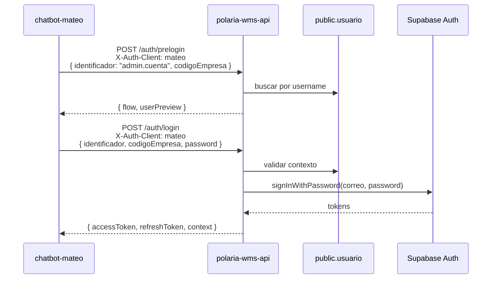
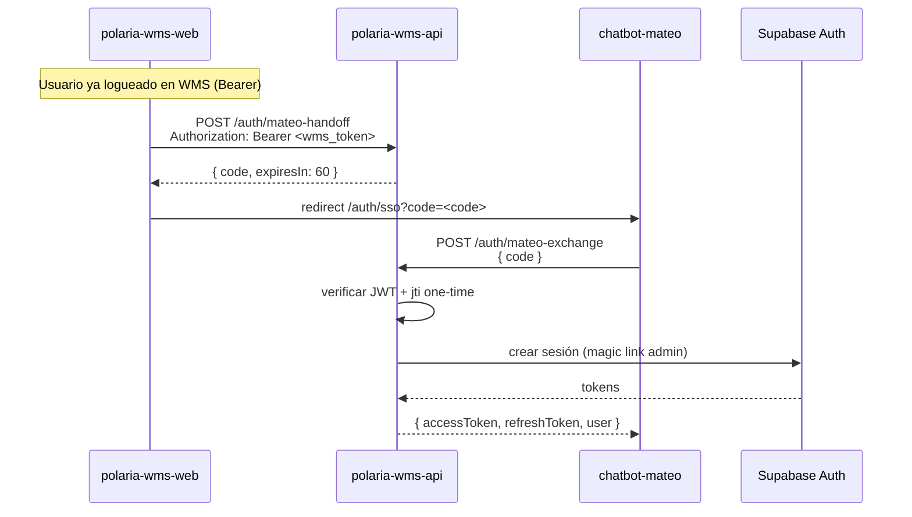

# Integración Mateo ↔ Polaria WMS API

Contrato de referencia para **polaria-wms-web**, **chatbot-mateo** y **polaria-wms-db**.

## Decisión de arquitectura: handoff con JWT (sin tabla en BD)

El SSO WMS → Mateo usa un **JWT firmado** con `MATEO_HANDOFF_SECRET`:

| Aspecto | Detalle |
|---------|---------|
| Formato | JWT HS256 |
| Payload | `{ sub: idAuth, jti: uuid, exp }` |
| TTL | 60 segundos |
| Uso único | `jti` registrado en memoria del proceso API al canjear |
| BD | **No requiere migración** en `polaria-wms-db` |

> **Nota operativa:** el registro de `jti` usados es in-memory por instancia. En despliegues multi-réplica, valorar sticky sessions o migrar a Redis/tabla si se detecta reuso entre réplicas.

---

## Widget embebido (canal web en WMS)

Experiencia **dentro** de Polaria WMS (sin redirect SSO). El handoff one-time (`MATEO_HANDOFF_SECRET`, TTL 60s) **no** se reutiliza aquí.

### JWT del widget (POL-73)

| Aspecto | Detalle |
|---------|---------|
| Endpoint | `POST /auth/mateo/widget-token` |
| Guards | `JwtAuthGuard` + `TenantGuard` (Bearer Supabase de sesión WMS) |
| Secreto | `MATEO_WIDGET_JWT_SECRET` (HS256, **distinto** de `MATEO_HANDOFF_SECRET`) |
| Header JWT | `alg=HS256`, `kid` = `MATEO_WIDGET_JWT_KID` (default `local-dev-v1`) |
| Issuer / Audience | `MATEO_WIDGET_JWT_ISSUER` / `MATEO_WIDGET_JWT_AUDIENCE` (defaults `bodega-frio-v2` / `mateo-support-widget`) |
| TTL | 300 segundos (5 min) |
| Uso | Reutilizable hasta `exp`; refresh con otro `POST` |
| Response | `{ token: string, expiresIn: number }` |

Payload JWT:

```json
{
  "sub": "<idAuth UUID Supabase>",
  "jti": "<uuid>",
  "idUsuario": "<uuid>",
  "codigoEmpresa": "EMP001 | null",
  "codigoCuenta": "CTA001 | null",
  "idRol": "administrador_cuenta",
  "rol": "administrador_cuenta",
  "email": "user@empresa.com",
  "given_name": "Ana",
  "family_name": "Pérez",
  "iss": "bodega-frio-v2",
  "aud": "mateo-support-widget",
  "iat": 1710000000,
  "exp": 1710000300
}
```

`idRol` y `rol` son el mismo valor (`usuario.id_rol` en BD). El widget también reenvía `id_rol` / `rol` / `id_usuario` / `email` en el **body** del webhook para que el workflow de n8n los pase al prompt sin decodificar el JWT.
**Contrato n8n (POL-71):** validar `Authorization: Bearer <token>` con el **mismo** `MATEO_WIDGET_JWT_SECRET`, comprobar `iss` / `aud` / `kid`, y resolver `sub` → `id_usuario` vía `resolve_web_user` en Supabase.

### Conversaciones (persistencia)

Esquema canónico en **polaria-wms-db**: `docs/WIDGET-MATEO-CONVERSACIONES.md`  
Migración: `051_widget_mateo_conversaciones.sql` (tablas `widget_conversacion`, `widget_mensaje` + RLS + `resolve_web_user`).

| Método | Ruta | Descripción |
|--------|------|-------------|
| GET | `/mateo/conversaciones` | Lista del usuario autenticado (`id_usuario` del tenant) |
| GET | `/mateo/conversaciones/:id` | Detalle + mensajes |
| POST | `/mateo/conversaciones` | Crear (`{ titulo? }`; `codigo_cuenta` desde tenant) |
| POST | `/mateo/conversaciones/:id/mensajes` | Append `{ rol, tipo?, contenido, esError?, createdAt? }` |
| DELETE | `/mateo/conversaciones/:id` | Eliminar si pertenece al usuario |

Guards: Bearer WMS + tenant. Ownership siempre por `id_usuario` del contexto. Prisma: `WidgetConversacion` / `WidgetMensaje`.

### Cierre POL-137 (identificación segura del chat)

| Capa | Evidencia |
|------|-----------|
| API | `POST /auth/mateo/widget-token` exige Bearer Supabase activo; emite JWT 300s con `idUsuario`, `codigoEmpresa`, `codigoCuenta`, `idRol` |
| API | `/mateo/conversaciones` filtra por `id_usuario` del tenant (404 si ajeno) |
| Web | `MateoWidgetHost` no monta sin `accessToken`; `configureTokenFetcher` → widget-token |
| Widget | `authToken.ts` rechaza sin fetcher; `embed.tsx` exige `tokenFetcher` o `configureTokenFetcher` previo |
| BD | RLS `widget_conversacion` por `id_usuario` + `codigo_cuenta` (migración `052`) |

Tests automatizados: `test/mateo-widget-auth.e2e-spec.ts`, `test/mateo-conversaciones.e2e-spec.ts`.

---

## Separación de credenciales por cliente

| Cliente | Header / query | `identificador` | Contraseña |
|---------|----------------|-----------------|------------|
| **WMS Web** | `X-Auth-Client: wms` o `?client=wms` | Solo **correo** válido (`usuario.correo`) | Misma que Supabase Auth |
| **Mateo** | `X-Auth-Client: mateo` o `?client=mateo` | Solo **username** (`usuario.username`) | Misma que Supabase Auth |
| **Legacy** | Sin header | Username **o** correo (comportamiento anterior) | Misma que Supabase Auth |

Internamente, Supabase Auth siempre autentica con **correo + password**. El API resuelve el usuario en `public.usuario` según el cliente antes de llamar a Supabase.

### Errores de discriminación

| Cliente | Condición | HTTP |
|---------|-----------|------|
| `wms` | `identificador` sin formato email | 400 |
| `mateo` | `identificador` con formato email | 400 |

---

## Flujo A — Login directo en Mateo



---

## Flujo B — SSO desde WMS (handoff)



---

## Flujo C — SSO desde Mateo (handoff inverso)

Mismos endpoints que el Flujo B, en sentido inverso. **No existen** `wms-handoff` / `wms-exchange`: el contrato es bidireccional.


### Endpoints bidireccionales

| Endpoint | Quién lo llama (origen) | Quién canjea (destino) |
|----------|-------------------------|------------------------|
| `POST /auth/mateo-handoff` | WMS **o** Mateo (Bearer Supabase) | — |
| `POST /auth/mateo-exchange` | Mateo **o** WMS (público, CORS) | — |

`mateo-handoff` solo exige un **Bearer JWT de Supabase válido** (`SupabaseAuthGuard`). No distingue si la sesión se abrió con `X-Auth-Client: wms` o `mateo`: ambos clientes emiten el mismo tipo de token para el mismo `idAuth`. El handoff firma `{ sub: idAuth, jti }` sin metadata de cliente.

---

## Endpoints

Base path: `/auth`

### POST /auth/prelogin y POST /auth/login

Headers opcionales:

```
X-Auth-Client: wms | mateo
```

Query alternativo: `?client=wms` o `?client=mateo`

Body sin cambios respecto a [API.md](../src/modules/auth/API.md).

---

### POST /auth/mateo-handoff

Genera código de un solo uso para SSO. **Requiere sesión Supabase activa** (WMS o Mateo).

#### Headers

```
Authorization: Bearer <accessToken>
```

> El token puede provenir de login con `X-Auth-Client: wms` o `mateo`; el endpoint no valida el cliente de origen.

#### Response 200

```json
{
  "code": "eyJhbGciOiJIUzI1NiIsInR5cCI6IkpXVCJ9...",
  "expiresIn": 60
}
```

#### Errores

| HTTP | Condición |
|------|-----------|
| 401 | Token ausente o inválido |
| 404 | Usuario no encontrado o inactivo |

---

### POST /auth/mateo-exchange

Canjea el código de handoff generado en cualquier dirección (WMS→Mateo o Mateo→WMS). **Endpoint público** (CORS habilitado para orígenes configurados).

#### Request

```json
{
  "code": "eyJhbGciOiJIUzI1NiIsInR5cCI6IkpXVCJ9..."
}
```

#### Response 200

```json
{
  "accessToken": "eyJ...",
  "refreshToken": "v1...",
  "user": {
    "idUsuario": "uuid",
    "username": "admin.cuenta",
    "nombre": "Admin Cuenta",
    "correo": "admin@empresa.com",
    "nombreRol": "Administrador de cuenta",
    "codigoEmpresa": "EMP001",
    "codigoCuenta": null,
    "scope": "tenant"
  }
}
```

| Campo `user.scope` | Valores |
|--------------------|---------|
| | `platform` (configurador) \| `tenant` (resto) |

#### Errores

| HTTP | Condición |
|------|-----------|
| 401 | Código inválido, expirado o ya utilizado |
| 404 | Usuario no encontrado tras canje |

---

## CORS

`mateo-exchange` es el único endpoint de handoff invocado desde el **navegador** del cliente destino (sin Bearer previo).

### polaria-wms-web (Mateo → WMS)

El frontend WMS proxea el API vía **`/api/*`** (rewrite en Next.js). En el navegador, `getApiBaseUrl()` devuelve `/api`, por lo que `POST /auth/mateo-exchange` desde `/auth/sso` es **same-origin** y **no requiere** añadir el origen del WMS a CORS del API.

### chatbot-mateo (WMS → Mateo)

Mateo llama al API **directamente** desde el navegador; su origen debe estar en la lista permitida.

### Orígenes por defecto

| Origen | Uso |
|--------|-----|
| `https://chatbot-mateo.vercel.app` | Producción Mateo |
| `http://localhost:3000` | Desarrollo local Mateo |

Variable: `MATEO_ALLOWED_ORIGINS` (lista separada por comas).

Si en el futuro el WMS llamara al API **sin proxy** (fetch directo a `NEXT_PUBLIC_API_BASE_URL` desde el browser), agregar el origen del WMS a esa variable (ej. `https://polaria-wms-web.vercel.app`, `http://localhost:3001`).

Headers permitidos: `Content-Type`, `Authorization`, `X-Auth-Client`.

---

## Variables de entorno

| Variable | Requerida | Descripción |
|----------|-----------|-------------|
| `MATEO_HANDOFF_SECRET` | **Sí** | Secreto para firmar/verificar JWT de handoff SSO |
| `MATEO_WIDGET_JWT_SECRET` | **Sí** (widget) | Secreto HS256 del JWT del widget embebido (≠ handoff); **mismo** valor que n8n POL-71 |
| `MATEO_WIDGET_JWT_ISSUER` | No | Default `bodega-frio-v2` |
| `MATEO_WIDGET_JWT_AUDIENCE` | No | Default `mateo-support-widget` |
| `MATEO_WIDGET_JWT_KID` | No | Default `local-dev-v1` (header JWT) |
| `MATEO_ALLOWED_ORIGINS` | No | Orígenes CORS para Mateo (default: ver arriba) |
| `SUPABASE_URL` | Sí | Cliente Auth |
| `SUPABASE_ANON_KEY` | Sí | Login y verificación OTP |
| `SUPABASE_SERVICE_ROLE_KEY` | Sí | `generateLink` admin para exchange |
| `DATABASE_URL` | Sí | Lookups en `public.usuario` |

---

## Responsabilidades por repositorio

| Repo | Responsabilidad SSO |
|------|---------------------|
| **polaria-wms-web** | Login con correo (`X-Auth-Client: wms`); **salida SSO**: botón "Mateo IA" → `mateo-handoff` → redirect Mateo `/auth/sso?code=`; **entrada**: `/auth/sso` → `mateo-exchange` → sesión WMS; **widget**: `MateoWidgetHost` → `POST /auth/mateo/widget-token` |
| **chatbot-mateo** | Login con username (`X-Auth-Client: mateo`); **salida**: botón WMS → `mateo-handoff` → redirect WMS `/auth/sso?code=`; **entrada**: `/auth/sso` → `mateo-exchange` → sesión Mateo |
| **Widget-react** | Bundle embebido; `configureTokenFetcher` + JWT widget; Shadow DOM |
| **polaria-wms-api** | Endpoints bidireccionales `mateo-handoff` / `mateo-exchange`; `mateo/widget-token`; CRUD `/mateo/conversaciones` |
| **polaria-wms-db** | Handoff sin tabla; widget: `widget_conversacion` / `widget_mensaje` + RLS + `resolve_web_user` |

---

## Ejemplos curl

### Mateo — prelogin + login

```bash
curl -X POST http://localhost:3000/auth/prelogin \
  -H "Content-Type: application/json" \
  -H "X-Auth-Client: mateo" \
  -d '{"identificador":"admin.cuenta","codigoEmpresa":"EMP001"}'

curl -X POST http://localhost:3000/auth/login \
  -H "Content-Type: application/json" \
  -H "X-Auth-Client: mateo" \
  -d '{"identificador":"admin.cuenta","codigoEmpresa":"EMP001","password":"***"}'
```

### WMS → Mateo — handoff + exchange

```bash
# Bearer tras login con X-Auth-Client: wms
curl -X POST http://localhost:3000/auth/mateo-handoff \
  -H "Authorization: Bearer <wms_access_token>"

# Canje desde chatbot-mateo
curl -X POST http://localhost:3000/auth/mateo-exchange \
  -H "Content-Type: application/json" \
  -d '{"code":"<handoff_jwt>"}'
```

### Mateo → WMS — handoff + exchange

```bash
# Bearer tras login con X-Auth-Client: mateo (mismo JWT Supabase)
curl -X POST http://localhost:3000/auth/mateo-handoff \
  -H "Authorization: Bearer <mateo_access_token>"

# Canje desde polaria-wms-web (vía proxy /api en browser, o directo en curl)
curl -X POST http://localhost:3000/auth/mateo-exchange \
  -H "Content-Type: application/json" \
  -d '{"code":"<handoff_jwt>"}'
```

### Widget — token

```bash
curl -X POST http://localhost:3000/auth/mateo/widget-token \
  -H "Authorization: Bearer <wms_access_token>"
# → { "token": "<jwt>", "expiresIn": 300 }
```

El JWT debe verificar en n8n con el **mismo** `MATEO_WIDGET_JWT_SECRET`, más `iss` / `aud` / `kid` (defaults arriba).

### Widget — conversaciones

```bash
# Listar
curl http://localhost:3000/mateo/conversaciones \
  -H "Authorization: Bearer <wms_access_token>"

# Crear
curl -X POST http://localhost:3000/mateo/conversaciones \
  -H "Authorization: Bearer <wms_access_token>" \
  -H "Content-Type: application/json" \
  -d '{}'

# Append mensaje (id = UUID de conversación)
curl -X POST http://localhost:3000/mateo/conversaciones/<uuid>/mensajes \
  -H "Authorization: Bearer <wms_access_token>" \
  -H "Content-Type: application/json" \
  -d '{"rol":"user","tipo":"text","contenido":"Hola","esError":false}'
```

> El `:id` de mensajes **debe ser UUID**. Ids locales del widget (`conv_*`) producen 400 (`ParseUUIDPipe`).

---

## Troubleshooting widget

| Síntoma | Causa | Acción |
|---------|--------|--------|
| Prisma `widget_conversacion` does not exist | Migración 051 no aplicada | Aplicar SQL en Supabase (`polaria-wms-db`) |
| n8n “sin permiso” / 401 | Secreto o `iss`/`aud`/`kid` distintos | Alinear env API ↔ credential store n8n |
| Append 400 | Path no-UUID | Actualizar Widget-react (alias local→UUID) |
| Respuesta AI en otra conversación | Race create remoto | Bundle reciente de Widget-react |
| P2021 / tabla ausente | DDL pendiente | GlobalExceptionFilter → 503 con mensaje claro |

> El código generado con token Mateo y el generado con token WMS (mismo usuario) son intercambiables: solo importa `sub` (`idAuth`) y validez del JWT de handoff.
